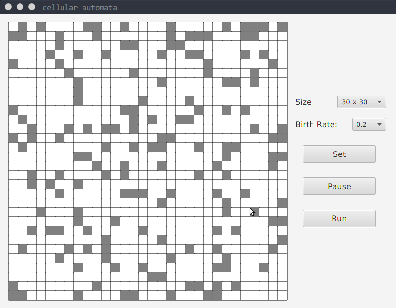
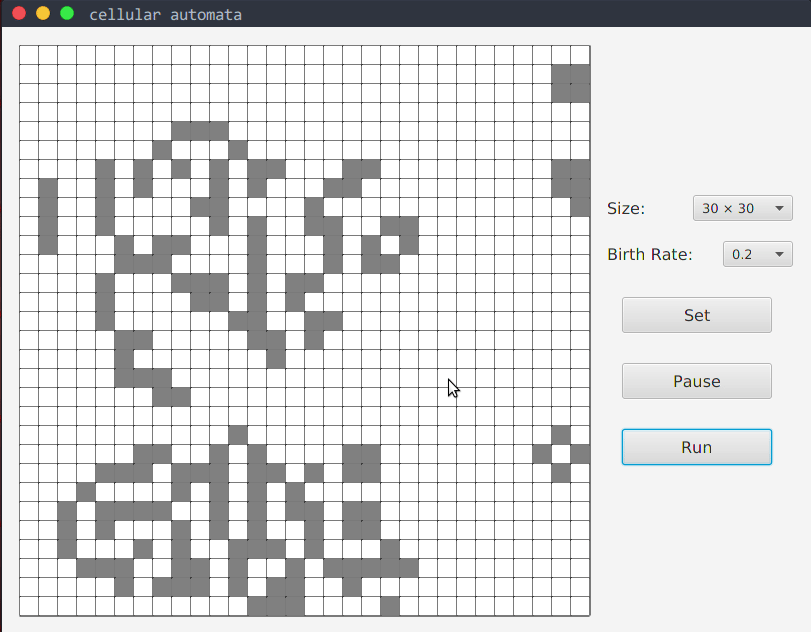

# Cellular_automata
A cellular automata consists of a regular grid of cells, each one of them will die or rebirth under different conditions. 

## Dead or reborn condition
If the current cell is **alive**
- the amount of cells `around` it is **less than 2** or **more than 3**, it will die. 
- the amount of cells `around` it lies between 2 and 3, it will shift to another living state.  

If the current cell is **dead**, and the amount of cells `around` it is **exactly 3**, it will rebirth.

## Some explanations
- I think the following picture defines the word `around` clearly:  
  

- the `Birth Rate` means that at the beginning of the test, all the cells are dead, and there is a certain propability for each cell to rebirth.

- all the cells alive will be colored **gray** or **black**(only for the newly born), otherwise **white**.

## Screen shots
- original(Size:30x30, Birth rate: 0.2)

- (Size:20x20, Birth rate: 0.5)

- (Size:40x40, Birth rate: 0.2/0.1)

