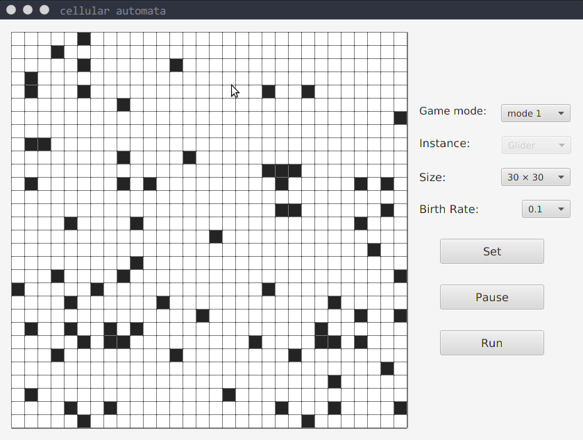
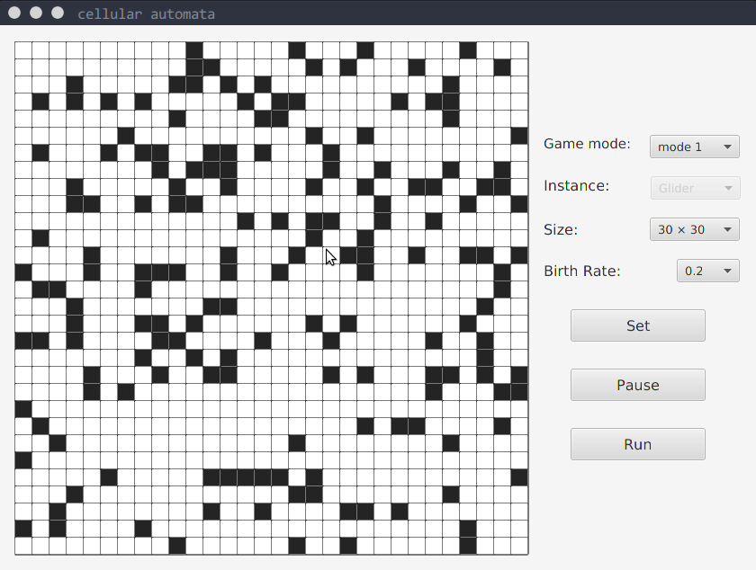
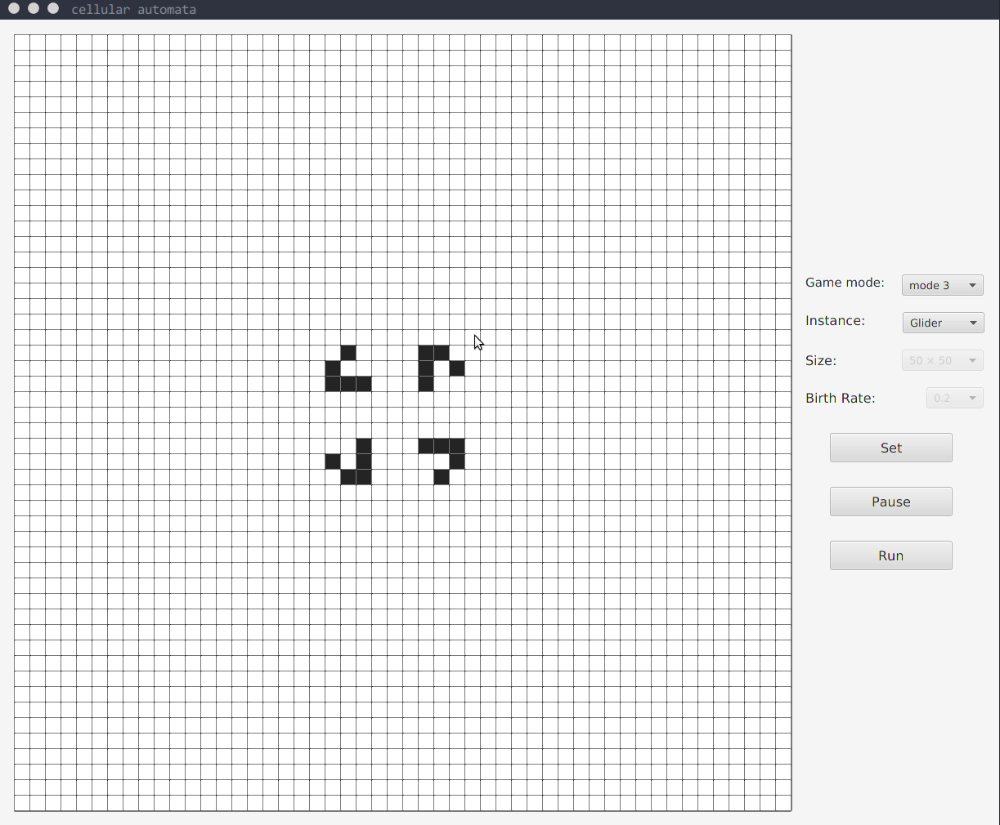

# Cellular_automata
A cellular automata consists of a regular grid of cells, each one of them will die or rebirth under different conditions. 

## Dead or reborn condition
If the current cell is **alive**
- the amount of cells `around` it is **less than 2** or **more than 3**, it will die. 
- the amount of cells `around` it lies between 2 and 3, it will shift to another living state.  

If the current cell is **dead**, and the amount of cells `around` it is **exactly 3**, it will rebirth.

## Some explanations
- I think the following picture defines the word `around` clearly:  
  

- In theory, the pane should have **infinite width and length**. Consequently, some strange phenomena breaking the rules will occur in the edge of the pane.

- The `Birth Rate` means that at the beginning of the test, all the cells are dead, and there is a certain propability for each cell to rebirth.

- All the cells alive will be colored **gray** or **black**(only for the newly born), otherwise **white**.

## Game mode

## Screen shots

### mode 1

### mode2

### mode 3

## What's more
What if two different cells influence with each other in only one grid pane? I also made a model to display this.  [click here to know more](https://github.com/TYC6/dual-cells-automata)